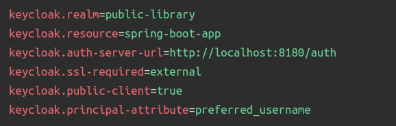
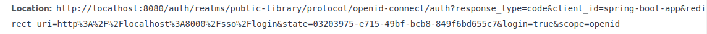
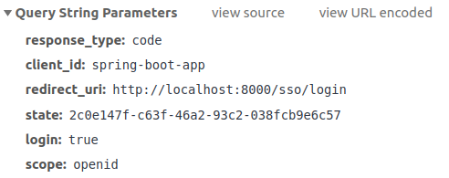
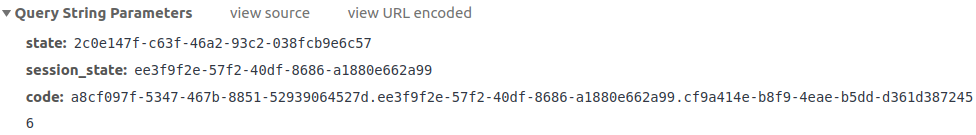

# Spring Boot application using Keycloak 
To authenticate and manage user in application

### Reference Documentation
* [Spring Security and Keycloak to Secure a Spring Boot Application - A First Look](https://www.thomasvitale.com/spring-security-keycloak/)

### Dependency
* spring-boot-starter-web, starter-thymeleaf, starter-security
* keycloak-spring-boot-starter (includes both spring boot adapter and security adapter)

### Setup Keycloak
* Create Realm: public-library
* Create client: spring-boot-app
* Create roles: Member & Librarian
* Create users and user role mapping

### Keycloak configuration in Spring  

    

### Step to perform authoz code flow
###### 1. Client (spring-boot-app) make redirect response:

    

###### 2. Which trigger Browser make authen request to Authoz endpoint:

    

###### 3. OP authen end-user
###### 4. If authen successfully, OP redirects Browser back to client (spring-boot-app) using redirectURI. URI includes authoz code and any local state provided by client

    

###### 5. Client request to Token Endpont using Authoz code reveived
###### 6. Client receive response contain: ID token and Access token

_Step 5 and 6 only perform from postman, because server-side application is confidential 
client --> cannot see access token from browser. (Cannot complete 2 steps)_

