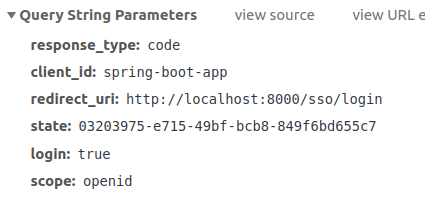

# Spring Boot application using Keycloak 
To authenticate and manage user in application

### Reference Documentation
* [Spring Security and Keycloak to Secure a Spring Boot Application - A First Look](https://www.thomasvitale.com/spring-security-keycloak/)

### Dependency
* spring-boot-starter-web, starter-thymeleaf, starter-security
* keycloak-spring-boot-starter (includes both spring boot adapter and security adapter)

### Setup Keycloak
* Create Realm: public-library
* Create client: spring-boot-app
* Create roles: Member & Librarian
* Create users and user role mapping

### Keycloak configuration in Spring  

    

### Authenticate Request (is OAuth2 Authoz request, Authoz code grant flow)
Client (spring-boot-app) make redirect response:

    

Which trigger Browser make authen request to Authoz endpoint:

    

